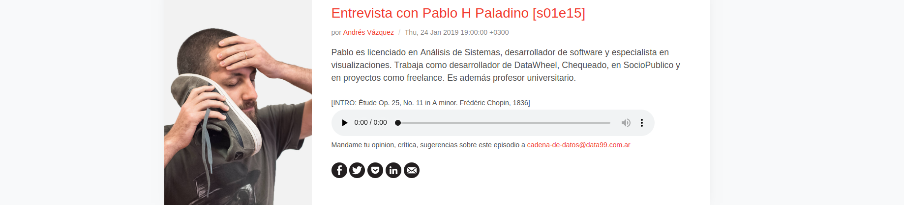

# Cadena de datos

Podcast con entrevistas a referentes de los datoas abiertos en Argentina.  
Se colocan los [audios](/audios-y-rss/audios) manualmente, se agregan [textos estructurados](/audios-y-rss/audios/ruso.json) y una [imagen](/audios-y-rss/audios/ruso.png) para cada uno.  
Finalmente con [un script](/audios-y-rss/generate-rss.py) se generan los archivos HTML (a través de un [template](https://colorlib.com/wp/template/podca/) almacenado [en este repo](/audios-y-rss/templates-html)).  
Esto genera [un sitio web](https://avdata99.github.io/cadena-de-datos/) que público gracias a _GitHub pages_.  

Además se generan feers RSS compatibles con las plataformas mas conocidas (Spotifu, Itunes, iVoox o cualquiera) vía [templates RSS](/audios-y-rss/templates-rss) que incluyen [info general del podcast](/audios-y-rss/audios/info.json).  

## Transcripciones de las entrevistas

Como es caro y complejo _desgrabar_ estas charlas uso la tecnología de YouTube que luego de subir un video (luego de [pasar de audio a video](/extras/mp3-to-mp4.sh)) te permite descargar una transcripción automática.  
Youtube entrega archivos de texto [en forma de subtítulo](/audios-y-rss/audios/s01e05-secchi.sbv) y los uso de referencia para corregir(no es 100% correcto lo que transcribe YouTube).  
Corregido el archivo SBV lo subo a YouTube para que se puede consumir con ese agregado y finalmente lo transofrmo a [texto crudo](/audios-y-rss/audios/s01e05-secchi.txt) con [un script](/extras/sbv.py).  

Este texto crudo me permite acomodar todo manualmente en HTML para publicar mejor.  

### TODOs

Probar el feed a itunes:  https://podba.se/validate/?url=https://avdata99.github.io/cadena-de-datos/audios-y-rss/audios/podcast_itunes.xml
Y ver como subirlo: https://help.apple.com/itc/podcasts_connect/#/itcd88ea40b9
